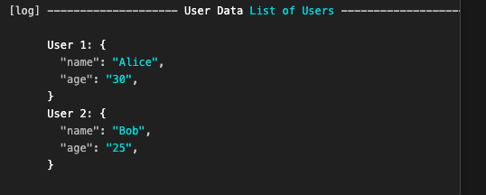
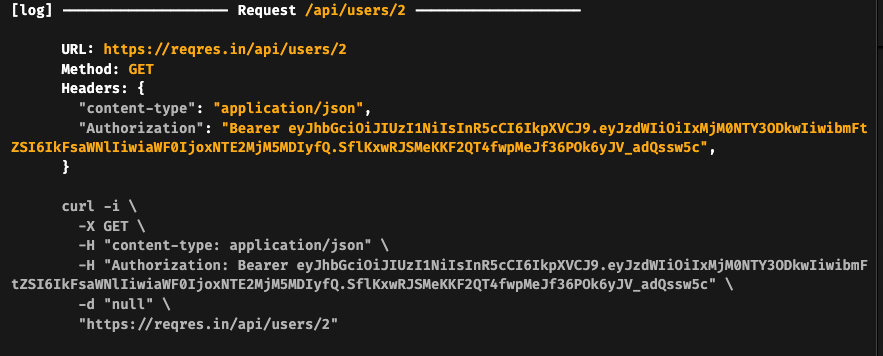
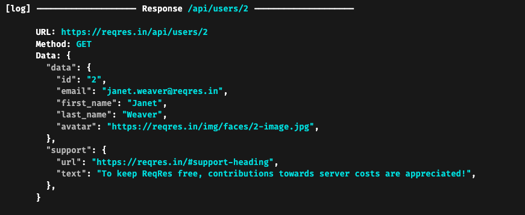

# log_package

A customizable Flutter package with built-in support for Dio interceptors, enabling detailed logging for network requests, responses, and errors. The package is designed to assist developers in monitoring their API interactions effectively with options to control the verbosity of logs.

## Features

- Log HTTP requests and responses using Dio interceptors.
- Toggle between logging different stages: request, response, and errors.
- Customize which parts of the request or response are logged (headers, data, etc.).
- Pretty-print JSON data for easy readability.
- Optionally log requests and responses as cURL commands.
- Colored logs for better distinction between request types and errors.
- General-purpose logging with `Log.info()` to format and log complex lists and maps.

## Usage

### 1. Pretty-printing Complex Data with `Log.info()`
The `Log.info()` function allows you to print human-readable and formatted logs of any data in your app, making it especially useful for complex lists or maps.

```dart
Log.info(
  title: LogInfoTitle(title: 'User Data', value: 'List of Users'),
  body: [
    LogInfoBody(title: 'User 1', value: {'name': 'Alice', 'age': 30}),
    LogInfoBody(title: 'User 2', value: {'name': 'Bob', 'age': 25}),
  ],
);
```

This will output:



### 2. Adding the Dio Interceptor to Log Network Requests

You can use the `LogDioInterceptro` to log all network traffic through Dio, with options to customize the verbosity of the logs.

```dart
import 'package:dio/dio.dart';
import 'package:your_package_name/log_dio_interceptor.dart';

final dio = Dio();
dio.interceptors.add(LogDioInterceptro(
  showRequest: true,
  showRequestCurl: true,
  showRequestData: true,
  showResponse: true,
  showResponseCurl: false,
  showResponseData: true,
  showError: true,
  showErrorData: true,
));
```

### 3. Logging Options

#### Log.info():
- `LogInfoTitle`: The title and optional value displayed in the log header.
- `LogInfoBody`: A list of key-value pairs (maps, lists, etc.) to be pretty-printed.

#### LogDioInterceptro:
- `showRequest`: Logs HTTP requests.
- `showRequestCurl`: Logs the request as a cURL command.
- `showRequestData`: Logs request body data.
- `showResponse`: Logs HTTP responses.
- `showResponseCurl`: Logs the response as a cURL command.
- `showResponseData`: Logs response body data.
- `showError`: Logs any errors encountered during requests.
- `showErrorData`: Logs the data related to errors.

### Installation

Add the following to your `pubspec.yaml`:

```yaml
dependencies:
  log: ^0.0.1
```

Then, run `flutter pub get` to install the package.

## Example Output

**Request Dio Interceptor Log:**



**Response Dio Interceptor Log:**



## Contribution

Contributions are welcome! Feel free to open issues, submit pull requests, or suggest new features.

---

*Happy logging with beautifully formatted data!*
